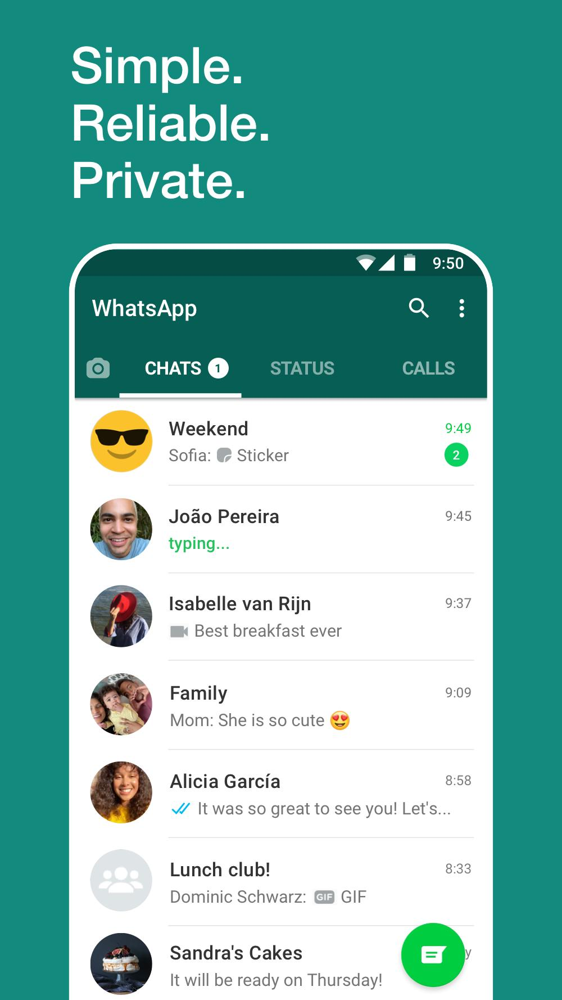

# Chat_with_yourself
It is a app that lets you type messages and send it, you can view the sent message as you see in any other chat apps like whatsapp or messenger.

## Getting Started
You can build apps with Flutter using any text editor combined with Flutter's command-line tools. However, I recommend using one of Flutter's editor plugins for an even better experience. These plugins provide you with code completion, syntax highlighting, widget editing assists, run & debug support, and more.

## Prerequisites
Things you need to install:
1. Flutter sdk
2. Android Studio/VS Code (IDE)

For more info head towards https://flutter.dev/docs/get-started/install 

## Built With
1. Flutter - The sdk used
2. VS Code - IDE used
3. Android Studio - Android sdk

## Authors
Souvik Banerjee

### Acknowledgments
Thanks to all whose codes were used.
